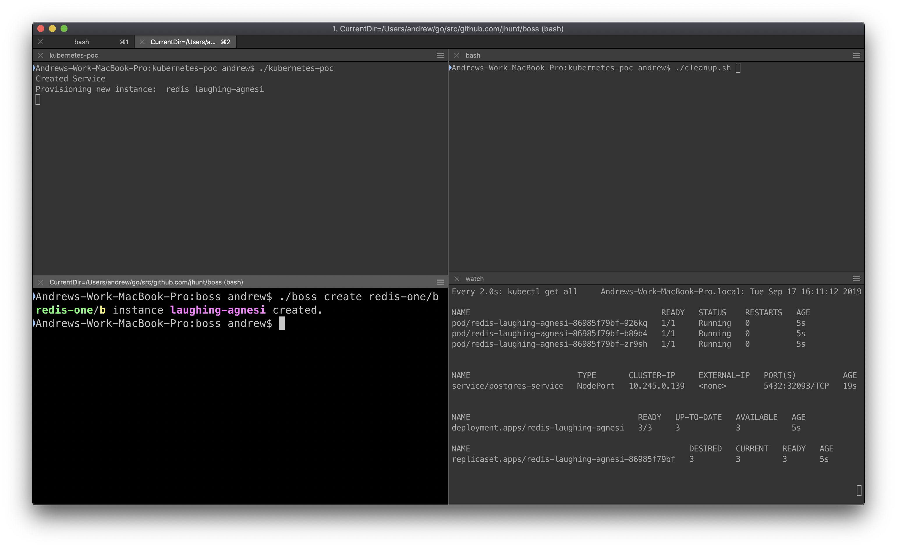

## A Kubernetes Service Broker, Deploying a 3-pod Redis and Postgres

### Running

To use the service broker, clone the repository then use:
`go build` 

## Important Notes

The service broker will target whatever Kubernetes instance your `kubeconfig` is currently pointed at. Make sure to update your `kubeconfig` accordingly.
